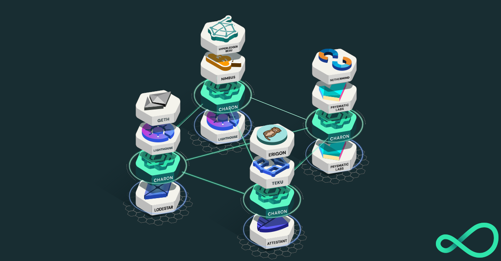

<h1 align="center">Distributed Validator Cluster with Docker Compose</h1>

This repo contains a [charon](https://github.com/ObolNetwork/charon) distributed validator cluster which you can run using [docker-compose](https://docs.docker.com/compose/).

This repo aims to give users a feel for what a [Distributed Validator Cluster](https://docs.obol.tech/docs/int/key-concepts#distributed-validator-cluster) means in practice, and what the future of high-availability, fault-tolerant proof of stake validating deployments will look like.

**This repo runs on a single machine, with only one execution and consensus client, you do not have fault tolerance with this setup, and this is only for demonstration purposes only, and should not be used in a production context.**

A distributed validator cluster is a docker-compose file with the following containers running:

- Single [Nethermind](https://github.com/NethermindEth/nethermind) execution layer client
- Single [Lighthouse](https://github.com/sigp/lighthouse) consensus layer client
- Single [MEV-boost](https://github.com/flashbots/mev-boost) client, used by the consensus layer client as its builder
- Six [charon](https://github.com/ObolNetwork/charon) Distributed Validator clients
- One [Lighthouse](https://github.com/sigp/lighthouse) Validator client
- One [Teku](https://github.com/ConsenSys/teku) Validator client
- One [Nimbus](https://github.com/status-im/nimbus-eth2) Validator client
- One [Prysm](https://github.com/OffchainLabs/prysm) Validator client
- Two [Lodestar](https://github.com/ChainSafe/lodestar) Validator clients
- Prometheus and Grafana for monitoring this cluster.



In the future, this repo aims to contain compose files for every possible Execution, Beacon, and Validator client combinations that is possible with DVT.

## Quickstart

You can view a quickstart guide for testing this repo out on our [docs site](https://docs.obol.tech/docs/start/quickstart_alone).

## Configuration

Copy the `.env.sample.<NETWORK>` file for the network you want to run on to `.env`, where `<NETWORK>` is one of `hoodi`, `sepolia` or `mainnet`:

```sh
cp .env.sample.hoodi .env
```

`ETH2_NETWORK` is required and has no default. The sample files set it, along with the matching Lighthouse checkpoint sync URL. `PROM_REMOTE_WRITE_TOKEN` is also required, since Prometheus exits on start without it. Set `FEE_RECIPIENT` to the address that should receive priority fees and MEV rewards. Every other variable is optional and overrides a default in `docker-compose.yml`.

## Updating

To update a running cluster without downtime, pull the latest changes and restart the charon nodes one at a time:

```sh
git pull && scripts/rolling-restart.sh
```

The script waits until every node is ready before and after each restart, and stops if a node doesn't become ready. Pass `--with-vcs` to also restart each node's validator client, and `--force-recreate` when the validator client scripts changed. See `scripts/rolling-restart.sh --help` for all options.

## Project Status

See [dvt.obol.tech](https://dvt.obol.tech/) for the latest status of the Obol Network including which upstream consensus clients and which downstream validators are supported.

> Remember: Please make sure any existing validator has been shut down for
> at least 3 finalised epochs before starting the charon cluster,
> otherwise your validator could be slashed.

# Troubleshooting

[Check the docs](https://docs.obol.tech/docs/faq/errors) for some common errors and how to fix them.
