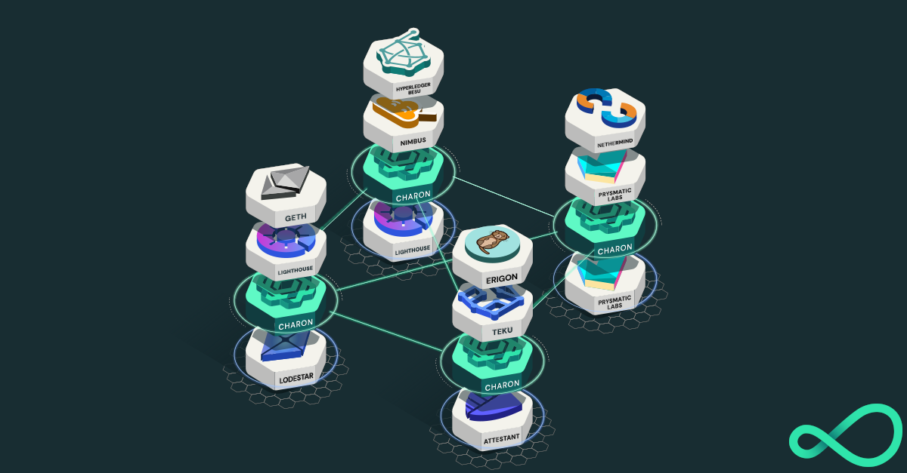

<h1 align="center">Distributed Validator Cluster with Docker Compose</h1>

This repo contains a [charon](https://github.com/ObolNetwork/charon) distributed validator cluster which can be run using [docker-compose](https://docs.docker.com/compose/).

This repo aims to give users a feel for what a [Distributed Validator Cluster](https://docs.obol.tech/docs/int/key-concepts#distributed-validator-cluster) means in practice, and what the future of high-availability, fault-tolerant proof of stake validating deployments will look like.

A distributed validator cluster is a docker-compose file with the following containers running:

- Six Charon Distributed Validator clients
- One Lighthouse Validator client
- Five Teku Validator Clients
- Prometheus, Grafana and Jaeger clients for monitoring this cluster.



In the future, this repo aims to contain compose files for every possible Execution, Beacon, and Validator client combinations that is possible with DVT.

## Quickstart

Ensure you have [docker](https://docs.docker.com/engine/install/) and [git](https://git-scm.com/downloads) installed. Also, make sure `docker` is running before executing the commands below.

1. Clone the [charon-distributed-validator-cluster](https://github.com/ObolNetwork/charon-distributed-validator-cluster) template repo and `cd` into the directory.

   ```sh
   # Clone the repo
   git clone https://github.com/ObolNetwork/charon-distributed-validator-cluster.git

   # Change directory
   cd charon-distributed-validator-cluster/
   ```

1. Prepare the environment variables

   ```sh
   # Copy the sample environment variables
   cp .env.sample .env
   ```

   For simplicities' sake, this repo is configured to work with a remote Beacon node such as one from [Infura](https://infura.io/).

   Create an Eth2 project and copy the `https` URL, make sure **Prater** is selected in dropdown of ENDPOINTS:

   

   Replace the placeholder value of `CHARON_BEACON_NODE_ENDPOINT` in your newly created `.env` file with this URL.

1. Create the artifacts needed to run a testnet distributed validator cluster

   ```sh
   # Create a testnet distributed validator cluster
   docker run --rm -v "$(pwd):/opt/charon" ghcr.io/obolnetwork/charon:v0.10.0 create cluster --withdrawal-address="0x000000000000000000000000000000000000dead" --nodes 6 --threshold 5
   ```

1. Start the cluster
   ```sh
   # Start the distributed validator cluster
   docker-compose up --build
   ```
1. Checkout the monitoring dashboard and see if things look all right

   ```sh
   # Open Grafana
   open http://localhost:3000/d/laEp8vupp
   ```

If all the above went correctly, it's natural to see logs like:

`INFO sched No active DVs for slot {"slot": 3288627}`

This is because you need to activate your freshly created distributed validator on the testnet with the [existing launchpad](https://prater.launchpad.ethereum.org/en/). The validator deposit data should be in `.charon/cluster/deposit-data.json`.

## Remote Beacon Node

This repo assumes the use of a remote Ethereum Consensus Layer API, offered through a product like [Infura](https://infura.io/).

This only makes sense for a demo validator, and should not be done in a production scenarion. Similarly, a remote beacon node drastically impacts the latency of the system, and is likely to produce sub par validator inclusion distance relative to one with a local consensus client.

The default cluster consists of six charon nodes using a mixture of validator clients:

- vc0: [Lighthouse](https://github.com/sigp/lighthouse)
- vc1: [Teku](https://github.com/ConsenSys/teku)
- vc2: [Teku](https://github.com/ConsenSys/teku)
- vc3: [Teku](https://github.com/ConsenSys/teku)
- vc4: [Teku](https://github.com/ConsenSys/teku)
- vc5: [Teku](https://github.com/ConsenSys/teku)

The intention is to support all validator clients, and work is underway to add support for vouch and lodestar to this repo, with nimbus and prysm support to follow in future. Read more about our client support [here](https://github.com/ObolNetwork/charon#supported-consensus-layer-clients).

## Create Distributed Validator Keys

Create some testnet private keys for a six node distributed validator cluster with the command:

```sh
docker run --rm -v "$(pwd):/opt/charon" ghcr.io/obolnetwork/charon:77f3497 create cluster --withdrawal-address="0x000000000000000000000000000000000000dead" --nodes 6 --threshold 5
```

This command will create a subdirectory `.charon/cluster`. In it are six folders, one for each charon node created. Each folder contains partial private keys that together make up the distributed validator described in `.charon/cluster/cluster-lock.json`.

### Activate your validator

Along with the private keys and cluster lock file is a validator deposit data file located at `.charon/cluster/deposit-data.json`. You can use the original [staking launchpad](https://prater.launchpad.ethereum.org/) app to activate your new validator with the original UI.

Your deposit will take at minimum 8 hours to process, near to the time you can run this new cluster with the command:

```
docker-compose up --build
```

## Import Existing Validator Keys

You might already have keys to an active validator, or are more comfortable creating keys with existing tooling like the [staking deposit CLI](https://github.com/ethereum/staking-deposit-cli) and [ethdo](https://github.com/wealdtech/ethdo).

To import existing EIP-2335 validator key stores:

```sh
# Create a folder within this checked out repo
mkdir split_keys

# Put the validator keystore.json files in this folder.
# Alongside them, with a matching filename but ending with `.txt` should be the password to the keystore.
# E.g. keystore-0.json keystore-0.txt

# Split these keystores into key shares for a distributed validator
make split-existing-keys
```

## Project Status

It is still early days for the Obol Network and everything is under active development.
It is NOT ready for mainnet.
Keep checking in for updates, [here](https://github.com/ObolNetwork/charon/#supported-consensus-layer-clients) is the latest on charon's supported clients and duties.

## Makefile features

### `make create`: Create required artifacts for a testnet cluster

`make create` performs the following actions:

- Call `charon create cluster` to produce ENRs, cluster lock files, distributed validator private keys, and deposit and exit data for the created validator.
- These artifacts are only suitable for test uses cases and should not be distributed to others. Clusters with groups of operators should perform a DKG ceremony using `charon dkg`.

### `make clean`: Clean and reset cluster

`make clean` performs the following actions:

- Stops and removes all running containers, `docker-compose down`
- Deletes created cluster artifacts

| ⚠️ The features below are only for the brave ⚔️ 🐉 |
| -------------------------------------------------- |

### `make split-existing-keys`: Create a cluster by splitting existing validator private keys

Existing validator keys stored in `./split_keys/` folder can be split into threshold private keys suitable for operating in a distributed validator.

```sh
# Create the folder that holds the original keystores
mkdir split_keys

# Copy in the keystores
cp path/to/existing/keys/keystore-*.json split_keys/

# Copy in the password files
cp path/to/passwords/keystore-*.txt split_keys/

# Each keystore-*.json requires a keystore-*.txt file containing the password.
make split-existing-keys

# Bring up the cluster
make up
```

> Remember: Please make sure any existing validator has been shut down for
> at least 3 finalised epochs before starting the charon cluster,
> otherwise your validator could be slashed.

# Troubleshooting

Here are some common errors and how to decipher how to fix them:

## Beacon Nodes

## Charon Nodes

- ```
  Fatal run error: read lock: open .charon/cluster/cluster-lock.json: permission denied
  Error: read lock: open .charon/cluster/cluster-lock.json: permission denied
  ```
  This error was received when I called `charon create cluster` on a local dev machine, and then copied and pasted the generated files in `.charon` to my remote eth2 server. The fix was to run `sudo chmod -R o+r .charon/`

## Validator Clients

### Teku

```
Keystore file /opt/charon/keys/keystore-0.json.lock already in use.
```

This can happen when you recreate a docker cluster with the same cluster files. Delete all `.charon/cluster/node<teku-vc-index-here>/keystore-*.json.lock` files to fix this.

```
java.util.concurrent.CompletionException: java.lang.RuntimeException: Unexpected response from Beacon Node API (url = http://node1:3600/eth/v1/beacon/states/head/validators?id=0x8c4758687121c3b35203c69925e8056799369e0dac2c31c9984946436f3041821080a58e6c1a813b4de1007333552347, status = 404)
```

This indicates your validator is probably not activated yet.

### Lighthouse

```
May 20 12:48:43.046 WARN Unable to connect to a beacon node      available: 0, total: 1, retry in: 2 seconds
May 20 12:48:45.048 WARN Offline beacon node                     endpoint: http://node0:3600/, error: Reqwest(reqwest::Error { kind: Request, url: Url { scheme: "http", cannot_be_a_base: false, username: "", password: None, host: Some(Domain("node0")), port: Some(3600), path: "/eth/v1/node/version", query: None, fragment: None }, source: hyper::Error(Connect, ConnectError("dns error", Custom { kind: Uncategorized, error: "failed to lookup address information: Temporary failure in name resolution" })) })
```

The above error was caused when the upstream charon client for this validator had died and not restarted.
